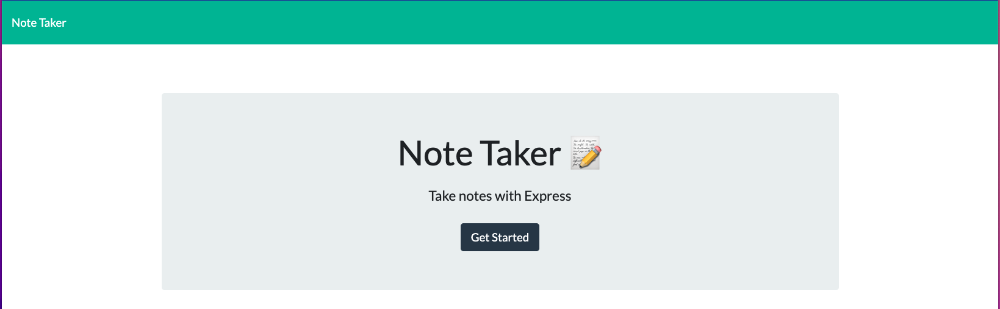
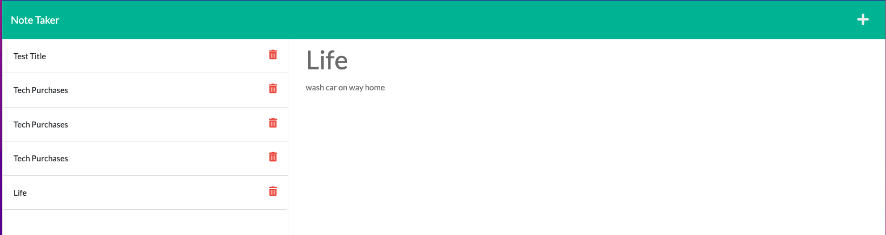
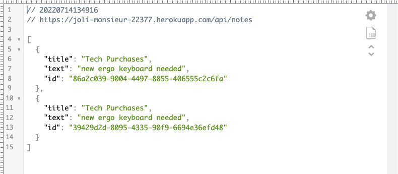

# Memos And Minutes
[](https://opensource.org/licenses/MIT)

## Description

This simple note taking application that can be used to write, save, and delete notes. This application uses an Express.js back end and will save and retrieve note data from a JSON file, and then will deploy the entire application to Heroku.

<details>
<summary><strong>Table of Contents</strong></summary>

- [User Story](#user-story)
- [Acceptance Criteria](#acceptance-criteria)
- [Installation](#installation)
- [Mock-up](#mockup)
- [Languages, Skills and Credits](#languages-skills-and-credits)
- [Links](#links)
</details>

## User Story

```
AS A small business owner
I WANT to be able to write and save notes
SO THAT I can organize my thoughts and keep track of tasks I need to complete
```

## Acceptance Criteria

```
GIVEN a note-taking application
WHEN I open the Note Taker
THEN I am presented with a landing page with a link to a notes page
WHEN I click on the link to the notes page
THEN I am presented with a page with existing notes listed in the left-hand column, plus empty fields to enter a new note title and the note’s text in the right-hand column
WHEN I enter a new note title and the note’s text
THEN a Save icon appears in the navigation at the top of the page
WHEN I click on the Save icon
THEN the new note I have entered is saved and appears in the left-hand column with the other existing notes
WHEN I click on an existing note in the list in the left-hand column
THEN that note appears in the right-hand column
WHEN I click on the Write icon in the navigation at the top of the page
THEN I am presented with empty fields to enter a new note title and the note’s text in the right-hand column
```

## Installation
To run the application locally:
- clone the repository
- for set up: run npm init, then npm install, finally npm uuid for the unique id creator
- run node server.js and then navigate to a localhost:3001 in your browser


## Mock-Up

The following images show the web application's appearance and functionality:








## Languages, Skills, and Credits
- Javascript
- NodeJS and ExpressJS
- Deployed on Heroku
- [UUID to create unique id's](https://www.npmjs.com/package/uuid)
- HTML
- CSS


## Links
The deployed website is available [here](https://joli-monsieur-22377.herokuapp.com/)

The deployed README is available [here](https://amccorkl.github.io/Memos-and-Minutes/) 

My Github repository is available [here](https://github.com/amccorkl/Memos-and-Minutes)
